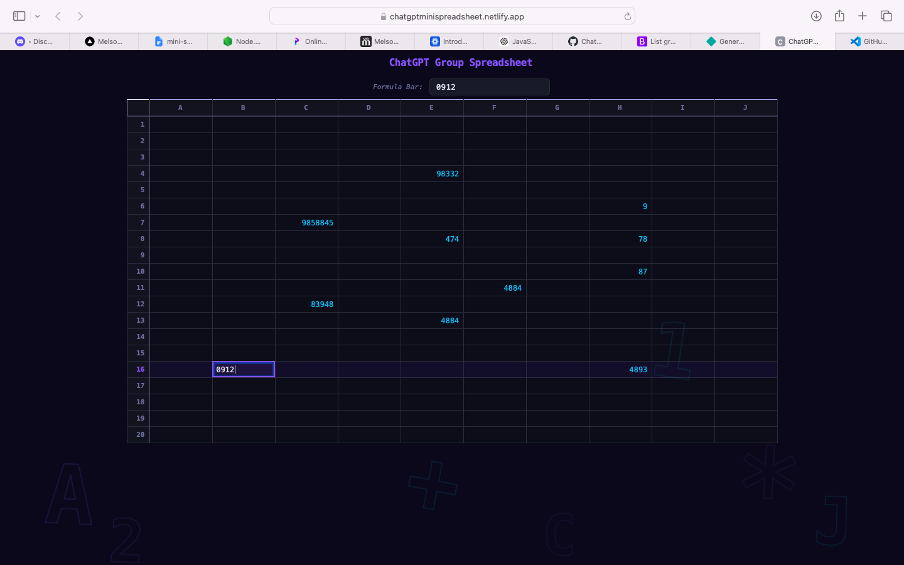
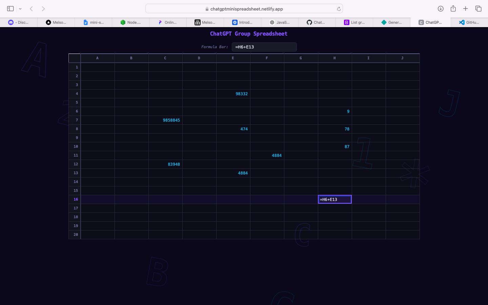

# ChatGPT Mini Spreadsheet

Access the app here: https://chatgptminispreadsheet.netlify.app

## Project Overview

This project is a mini spreadsheet application built as a group project. It allows users to interact with a simple spreadsheet-style interface, enter data, and use backend logic to process and evaluate spreadsheet-like expressions.

## How to Use It

1. Open the app in your browser using the link above.
2. Enter values or formulas into the spreadsheet cells.
3. Use the interface to update the sheet and view the results.
4. If you are running the project locally, start the frontend and backend services and open the local URL in your browser.

## Technologies Used

- Frontend: HTML, CSS, JavaScript
- Backend: JavaScript
- Testing: Jest-style JavaScript tests

## Features

- Simple spreadsheet-style interface
- Cell input and editing
- Basic spreadsheet evaluation logic
- Backend processing for spreadsheet operations
- Test coverage for core tokenizer and evaluator functionality

## Project Structure

- frontend/ - Contains the user interface files
  - index.html - Main HTML file
  - style.css - Styles for the app
- backend/ - Contains the server-side logic and tests
  - evaluator.js - Spreadsheet evaluation logic
  - evaluator_test.js - Tests for evaluation logic
  - tokenizer.js - Tokenizer logic for parsing spreadsheet expressions
  - tokenizer_test.js - Tests for tokenizer logic
  - script.js - Backend script entry point
  - dependency_graph.js - Dependency graph logic

## Team Members

- Frontend: Malebo, Owethu
- Backend: Portia, Shaun, Mandla

## Project Screenshots

